% Tecnicatura Universitaria en Inteligencia Artificial
% U.N.R.


* Sistema de control de versiones (SCM). https://git-scm.com/ 


* Esencialmente, rastrea los cambios de nuestros archivos, 


				y permite ir hacia atrás si hace falta.


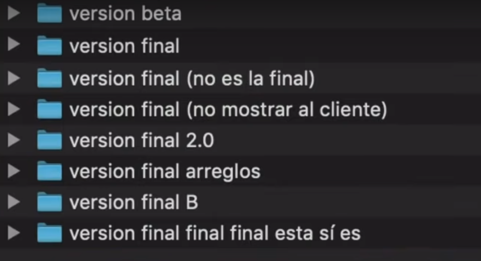{width=70%}


* Creado originalmente por Linus Torvalds en 2005...


{width=30%}


## Flexible, jerárquico, distribuido


{width=70%}


* Programado en: C, Bourne Shell, Perl


* Es un proyecto de código abierto


* Una de sus principales caracteristicas es que es distribuido.


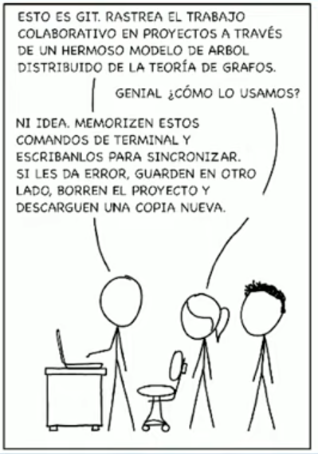{width=30%}


## Config

```bash
$ git config --global user.name "Alan Turing"
$ git config --global user.email "aturing@princeton.edu"
```

```bash
$ git config --global credential.helper store
```


## ¿Cómo arranca un repositorio?

1. clonando:
```bash
$ git clone https://github.com/aleoncavallo/tutorial_bash
```


```bash
Clonando en 'tutorial_bash'...
remote: Enumerating objects: 186, done.
remote: Counting objects: 100% (35/35), done.
remote: Compressing objects: 100% (31/31), done.
remote: Total 186 (delta 18), reused 10 (delta 4), pack-reused 151
Resolviendo deltas: 100% (64/64), listo.
```

## ¿Cómo arranca un repositorio?

2. inicializando:


```bash
~/$ git init proyecto
```


```bash
Inicializado repositorio Git vacío en /home/aleoncavallo/proyecto/.git/
```


```bash
~$ cd proyecto/
```


## Mirando el estado


```bash
~/tutorial_bash$ git status
```


```bash
En la rama master
Tu rama está actualizada con 'origin/master'.

nada para hacer commit, el árbol de trabajo está limpio
```

## Mirando el estado

```bash
~/proyecto$ touch otro.sh
```


```bash
```


```bash
~/proyecto$ git status
```


```bash
En la rama master
Tu rama está actualizada con 'origin/master'.

Archivos sin seguimiento:
	otro.sh
	script.sh

no hay nada agregado al commit pero hay archivos sin seguimiento presentes 
  (usa "git add" para hacerles seguimiento)
```

## Estados de un archivo


{width=90%}


## Stagin area (escenario)

```bash
~/proyecto$ git add script.sh
```


```bash
~/proyecto$ git status
```


```bash
En la rama master
Tu rama está actualizada con 'origin/master'.

  (usa "git restore --staged <archivo>..." para sacar del área de stage)
	nuevos archivos: script.sh
Archivos sin seguimiento:
	otro.sh

```


## Esquema general de uso de git


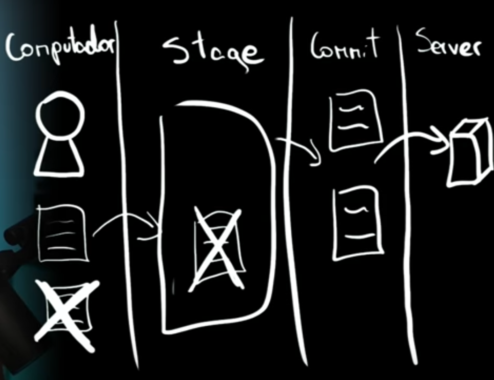{width=60%}


## Commit (compromiso)

```bash
~/proyecto$ git commit -m "Inicio proyecto"
```


```bash
[master (commit-raíz) 4ac0385] Inicio proyecto
 create mode 100644 script.sh
```


```bash
~/proyecto$ git status
```


```bash
En la rama master
Archivos sin seguimiento:
	otro.sh

no hay nada agregado al commit pero hay archivos sin seguimiento presentes 
  (usa "git add" para hacerles seguimiento)
```


## Commit (compromiso)

* Es una fotografía de una situación de nuestro código/proyecto 
Se puede pensar como la foto completa del árbol de los estados hasta el momento


* Es un hash criptográfico de:


Lo calculan con optimizaciones para no computar el hash desde cero cada vez 


## Log 

```bash
~/proyecto$ git log -p
```


```bash
commit 4ac03851baed8e79c19ba3c2e3707d0f8477abc8 (HEAD -> master)
Author: Andrea Leon Cavallo <aleoncavallo@gmail.com>


diff --git a/script.sh b/script.sh
new file mode 100644
index 0000000..34cae35
--- /dev/null
+++ b/script.sh
@@ -0,0 +1 @@
+echo hola mundo!
```

## Diff Unificado

```bash
~/proyecto$ git show
```

```bash
commit 06031abc6fd5794e7b5e1bc6b941d0d3984408df (HEAD -> master)
Author: Andrea Leon Cavallo <aleoncavallo@gmail.com>


diff --git a/script.sh b/script.sh
index 34cae35..baaa505 100644
--- a/script.sh
+++ b/script.sh
@@ -1 +1 @@
-echo hola mundo!
+echo ¡hola mundo!

```

## Borrar archivos

* `git rm` borra un archivo (y anota el cambio en la staging area). Es lo

```bash
~/proyecto$ git rm script.sh
```


```bash
rm 'script.sh'
```


```bash
~/proyecto$ git status
```


```bash
On branch master
Your branch is up to date with 'origin/master'.
Changes to be committed:
(use "git restore --staged <file>..." to unstage)
deleted:
script.sh
```


```bash
$ git commit -m "Borrar main"
```


```bash
[master f068e5f] Borrar main
delete mode 100644 main.c
```


## Buenas prácticas

* Commits lo más pequeños posibles (“atómicos”): permite revertir fácilmente


* Mensajes descriptivos: “cambios” vs “Agrego tal funcionalidad”


## Remotes

Ahora nos falta compartir con otros los cambios hechos:


* Push: actualiza el repositorio remoto desde el local (sólo cambios commiteados)


* Pull: actualiza el repositorio local desde el remoto


## Remotes


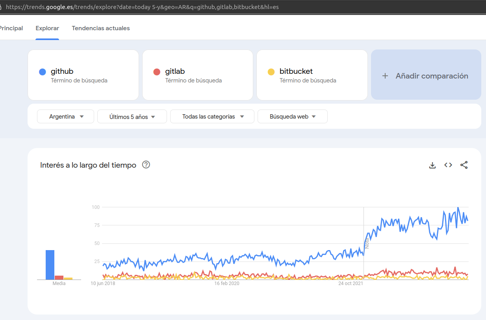{width=50%}


## Remotes

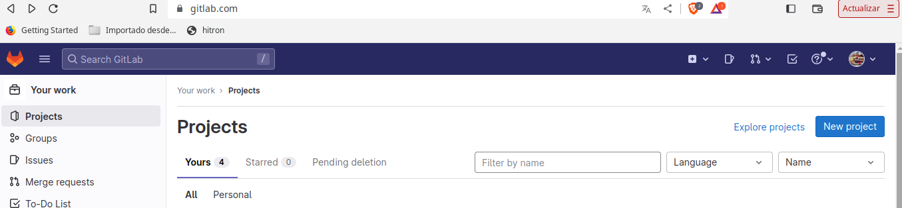{width=90%}

## Remotes

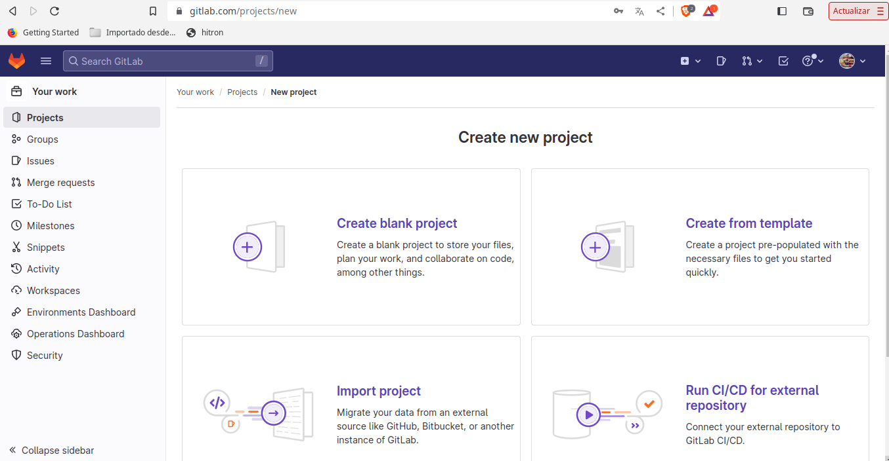{width=90%}

## Remotes

{width=90%}

## Remotes

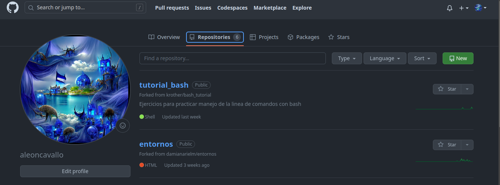{width=90%}

## Remotes

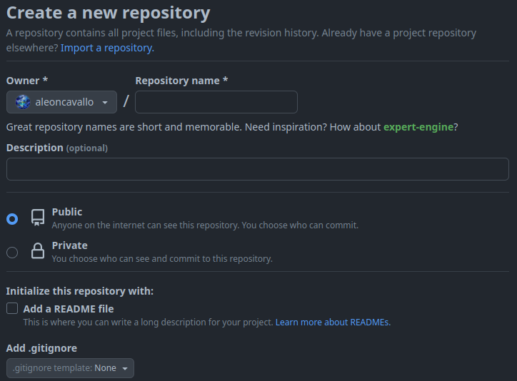{width=60%}

## Remotes

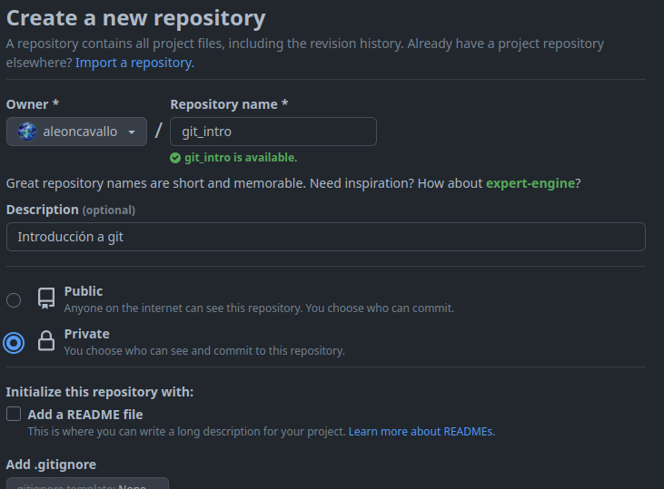{width=60%}

## Remotes

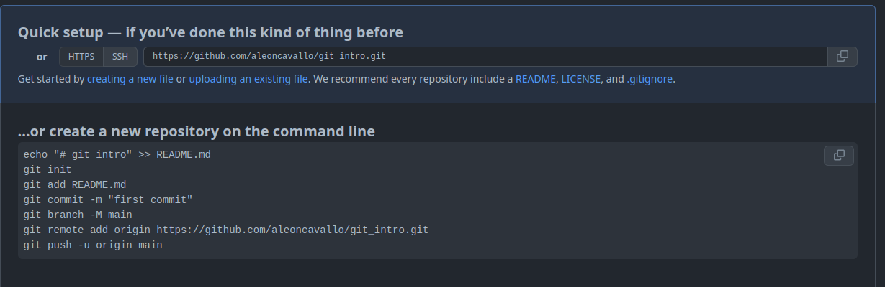{width=90%}


## Remotes


Para el caso de la autenticación por ssh 
será necesario generar la clave siguiendo las instrucciones en:
[](https://docs.github.com/es/authentication/connecting-to-github-with-ssh/about-ssh)

Para simplificar nos manejaremos con GitLab, usando el link con https

## 

Lo más básico ya está


## Revirtiendo cambios
* `git checkout <file>`: revierte cambios locales.
* `git reset`: vacía el staging area.
* `git reset <commit>`: vuelve al commit, sin modificar archivos.
* `git reset --hard \<commit>`: vuelve al commit, descartando todo.


## Branches (Ramas)
* `git checkout <b>`: cambiar de branch
* master suele ser la rama principal


## Merge (Unir ramas)


* En branch source `git merge <commit>`.


Pull tiene merge implícito, push sólo permite “fast-forwards”.


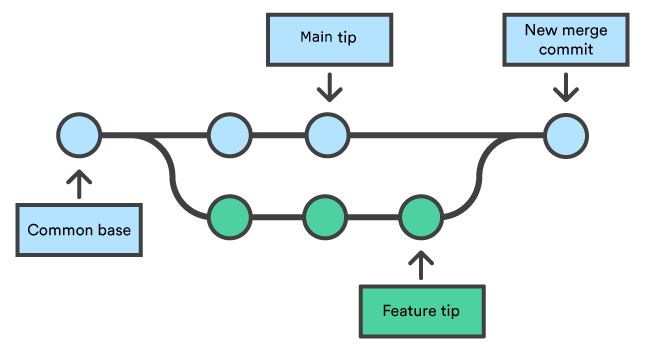{width=60%}


Posiblemente haya que corregir conflictos


## Rebase


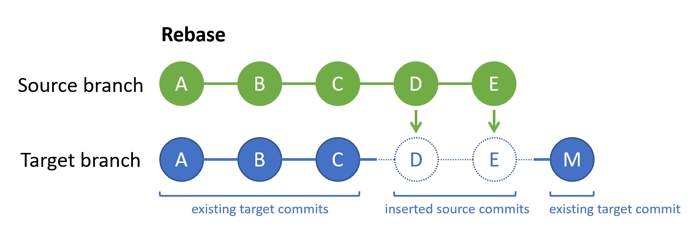{width=60%}

* Generalmente sólo se hace en ramas privadas


## Bisect

`git bisect` 
 ir dividiendo toda la pila de commits en dos partes, 


## Clean

Usar con mucho cuidado...

* `git clean -dfx`: borra todo lo que no esté trackeado/staged
* `git clean -x`: borra sólo archivos ignorados (suele ser seguro)
* Flag -n: no hacer nada, imprimir lo que haría


* Sitio oficial de git: https://git-scm.com/

* Guía de git:  https://rogerdudler.github.io/git-guide/


* Video Aprende GIT de HolaMudo https://www.youtube.com/watch?v=VdGzPZ31ts8

* https://diegobersano.wordpress.com/2017/06/13/introduccion-a-git-repaso-a-los-conceptos-generales/
