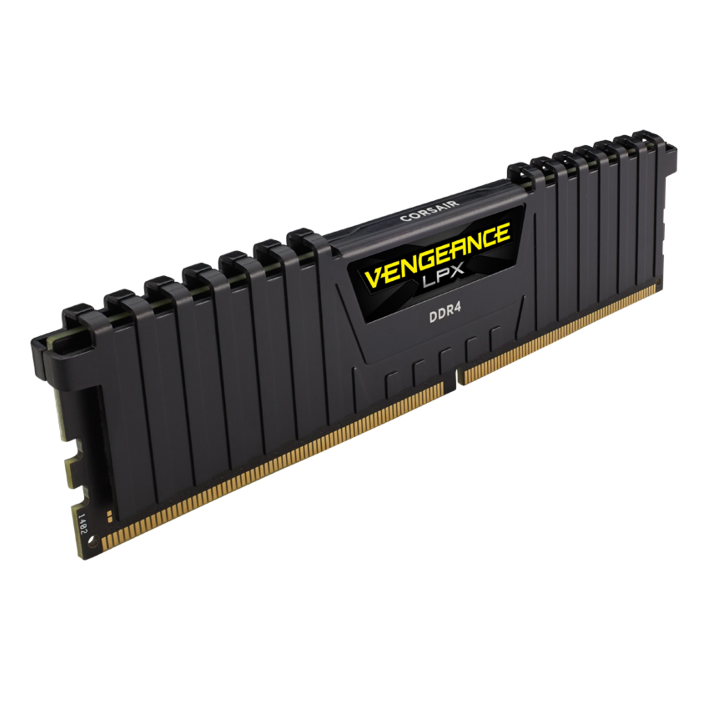
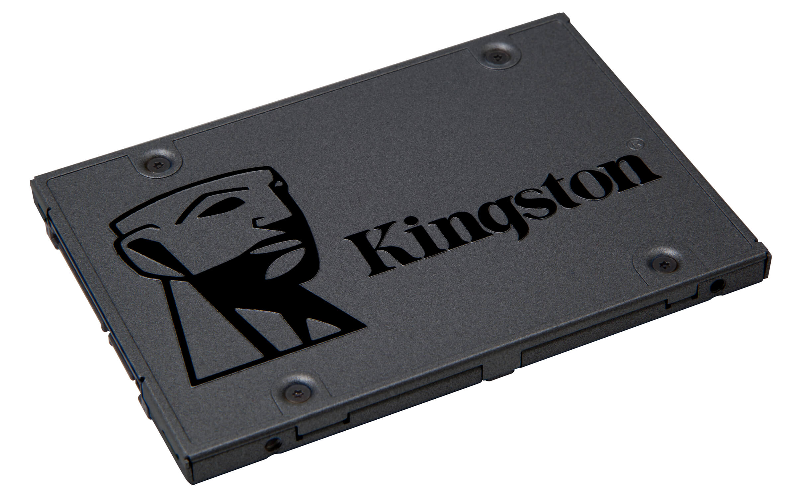

% Arquitectura de la Computadora

###### Gabinete ######

::::: {.columns}
::: {.column width=45%}

:::
::: {.column width=55%}
El gabinete de la PC es una carcasa que cubre y protege los componentes
de una computadora. Sus principales funciones son: \
\

. . .

Protección
: El gabinete protege los componentes de la computadora de daños físicos, polvo
y otros factores ambientales que pueden dañarlos.

. . .

Organización
: Los gabinetes de PC están diseñados para mantener todos los componentes en su
lugar y organizados de manera eficiente. Esto hace que sea más fácil para el
usuario trabajar en la computadora y realizar mejoras o reparaciones.

. . .

Refrigeración
: Los gabinetes de PC también ayudan a mantener los componentes frescos mediante
la circulación de aire a través de la carcasa. Muchos gabinetes tienen ventiladores
y otros sistemas de enfriamiento integrados para evitar el sobrecalentamiento
de la computadora.
:::
:::::

###### Placa Madre ######

{width=45%}

La placa madre es la pieza central de una computadora, encargada de
conectar y comunicar todos los componentes esenciales del sistema. A través
de sus conectores, la placa madre une la CPU, la memoria RAM, las unidades
de almacenamiento, la tarjeta gráfica y otros dispositivos.

. . .

Además, la placa madre distribuye la energía eléctrica necesaria a todos
los componentes a través de los conectores de alimentación, y controla los
puertos de entrada/salida que permiten la comunicación de la computadora
con dispositivos externos, como los puertos USB, de audio y de red.

. . .

La placa madre también incluye un chip de memoria ROM donde se almacena la BIOS,
un programa que se encarga de configurar la computadora al encenderla y realizar
pruebas iniciales del hardware.

. . .

La mayoría de las placas madre tienen un chip de audio integrado que
proporciona capacidades de audio.

###### Fuente de Alimentación ######

::::: {.columns}
::: {.column width=45%}

:::
::: {.column width=55%}
La PSU (Power Supply Unit) o fuente de alimentación se encarga de convertir la
corriente eléctrica de la toma de corriente en la energía eléctrica necesaria
para alimentar los componentes internos de la computadora. \
\

. . .

Esta recibe la corriente eléctrica de la toma de corriente a través del cable
de alimentación y la convierte en diferentes voltajes que son suministrados a
los componentes de la computadora. \
\

. . .

La PSU también protege los componentes de la computadora de sobretensiones,
cortocircuitos y otros problemas eléctricos que pueden ocurrir. En caso de que
se detecte una sobrecarga o falla, la PSU puede cortar el suministro de energía
para proteger los componentes de la computadora.
:::
:::::

###### Microprocesador ######

{width=40%}

La CPU (Unidad Central de Procesamiento) es el componente principal de
una computadora que realiza la mayoría de las operaciones de procesamiento
de datos. Es un chip integrado que se coloca en el zócalo de la placa madre
y está compuesto por varios núcleos (o cores) que trabajan en conjunto para
ejecutar instrucciones y procesar datos. \
\

. . .

La CPU es responsable de procesar y ejecutar los programas de software,
manejar la entrada y salida de datos, y controlar los componentes del sistema,
como la memoria RAM, el disco duro y las tarjetas de expansión. La velocidad
y la capacidad de la CPU son factores clave que determinan el rendimiento general
de una computadora. \
\

. . .

Algunos procesadores modernos tienen gráficos integrados en su diseño.
Estos gráficos integrados se denominan iGPU (unidad de procesamiento de
gráficos integrados) y están diseñados para proporcionar capacidades gráficas
básicas para aplicaciones informáticas y de juegos de baja exigencia.

###### Memoria RAM ######

::::: {.columns}
::: {.column width=45%}

:::
::: {.column width=55%}
La memoria RAM (Random Access Memory o Memoria de Acceso Aleatorio) es un tipo
de memoria que se utiliza en las computadoras para almacenar temporalmente los
datos y programas que están en uso. La RAM es un componente clave en el
rendimiento general de una computadora, ya que proporciona un acceso rápido y
aleatorio a los datos y programas que el procesador necesita para operar. \
\

. . .

Cuando una aplicación o un programa se ejecuta en la computadora, los
datos y las instrucciones necesarios se cargan en la memoria RAM desde el
disco duro. La RAM permite que el procesador acceda rápidamente a estos
datos y programas, lo que acelera el tiempo de ejecución y la velocidad de la
computadora en general. \
\

. . .

Además, la memoria RAM es una memoria *volátil*, lo que significa que
pierde todos los datos almacenados en ella cuando se apaga la computadora.
Por lo tanto, es importante guardar los archivos y datos importantes en el
disco duro o en otro dispositivo de almacenamiento persistente.
:::
:::::

###### Memoria secundaria ######

::::: {.columns}
::: {.column width=45%}

:::
::: {.column width=55%}
Un disco duro es un dispositivo de almacenamiento de datos magnético
que se utiliza en las computadoras para almacenar permanentemente archivos
y programas. A diferencia de la memoria RAM, que es una memoria volátil y
pierde todos los datos almacenados en ella cuando la computadora se apaga,
el disco duro mantiene los datos almacenados incluso después del apagado
de la computadora. \
\

. . .

Una de las principales diferencias entre el disco duro y la memoria RAM
es la velocidad. La memoria RAM proporciona un acceso rápido y aleatorio
a los datos y programas, lo que permite al procesador acceder a ellos rápidamente.
En comparación, los discos duros son mucho más lentos en términos de velocidad
de acceso, ya que el brazo de lectura/escritura necesita moverse físicamente
para acceder a los datos en los platos. \
:::
:::::

###### Memoria secundaria ######

::::: {.columns}
::: {.column width=45%}

:::
::: {.column width=55%}
Una SSD (Solid State Drive) es un dispositivo de almacenamiento de datos que
utiliza memoria flash para almacenar permanentemente archivos y programas en la
computadora. A diferencia de un disco duro tradicional, que utiliza platos
magnéticos giratorios y cabezas de lectura/escritura para acceder a los datos,
una SSD no tiene partes móviles y utiliza chips de memoria flash para almacenar
y acceder a los datos.\
\

. . .

La tecnología SSD es más rápida que la de un disco duro porque no hay
partes mecánicas que necesiten moverse para acceder a los datos. En lugar
de eso, los datos se almacenan en chips de memoria flash, que son mucho
más rápidos para acceder y leer que los discos duros. Como resultado, las SSD
proporcionan un mejor rendimiento en términos de velocidad de lectura/escritura
y tiempo de acceso.

:::
:::::

###### Placa de Video ######

{width=40%}

Una placa de video, también conocida como tarjeta gráfica, es un componente de
hardware de la computadora que tiene como objetivo procesar y generar imágenes
en la pantalla. Su función es liberar a la CPU (unidad central de procesamiento)
de la computadora de la tarea de procesamiento gráfico, lo que permite que la
CPU se concentre en otras tareas.

. . .

Además de su uso en gráficos, en el campo de la inteligencia artificial son
comúnmente utilizadas para entrenar y ejecutar redes neuronales profundas,
que son un tipo de algoritmo de aprendizaje automático. Esto se debe a que
las placas de video tienen una arquitectura altamente paralela que les permite
procesar grandes cantidades de datos de manera eficiente. Como resultado,
las placas de video son ideales para el procesamiento masivo de datos que se
requiere en la inteligencia artificial.
