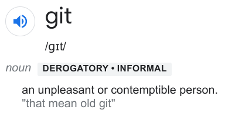
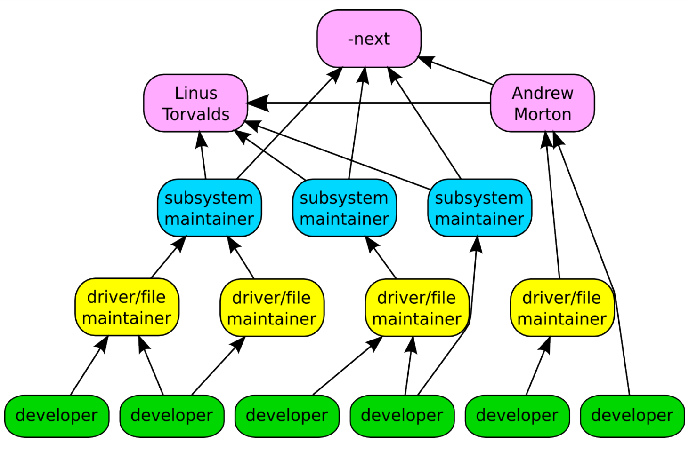
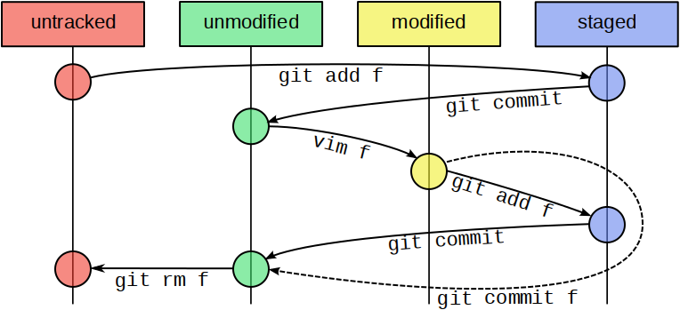

% Entorno de Programación - Introducción a scm y git
% Tecnicatura Universitaria en Inteligencia Artificial
% U.N.R.

## Introducción a git

. . . 

* Sistema de control de versiones (SCM).

. . .

* Esencialmente, rastrea los cambios de nuestros archivos, 

. . .

				y permite ir hacia atrás si hace falta.


## Introducción a git


. . .

* Creado originalmente por Linus Torvalds en 2005...

. . .

                                                          en semanas.

. . .

{width=30%}


## Flexible, jerárquico, distribuido


{width=70%}


## Introducción a git


* Programado en: C, Bourne Shell, Perl

. . .

* Es un proyecto de código abierto

. . .

* Una de sus principales caracteristicas es que es distribuido.

. . . 

* Cada desarrollador tiene todo el código y toda la historia.  


## ¿Cómo arranca un repositorio?

1. inicializando:

. . .

```bash!
~$ mkdir proyecto/
```

. . .

```bash!
~$ cd proyecto/
```

. . .

```bash!
~/proyecto$ git init
```

. . .

```bash!
Inicializado repositorio Git vacío en /home/aleoncavallo/proyecto/.git/
```

## ¿Cómo arranca un repositorio?

2. clonando:
```bash!
$ git clone https://github.com/aleoncavallo/tutorial_bash
```

. . .

```bash!
Clonando en 'tutorial_bash'...
remote: Enumerating objects: 186, done.
remote: Counting objects: 100% (35/35), done.
remote: Compressing objects: 100% (31/31), done.
remote: Total 186 (delta 18), reused 10 (delta 4), pack-reused 151
Recibiendo objetos: 100% (186/186), 821.02 KiB | 5.20 MiB/s, listo.
Resolviendo deltas: 100% (64/64), listo.
```

## Mirando el estado


```bash!
~/tutorial_bash$ git status
```

. . . 

```bash!
En la rama master
Tu rama está actualizada con 'origin/master'.

nada para hacer commit, el árbol de trabajo está limpio
```

## Mirando el estado

```bash!
~/proyecto$ touch otro.sh
```

. . .

```bash!
~/proyecto$ echo 'echo hola mundo!' > script.sh
```

. . . 

```bash!
~/proyecto$ git status
```

. . .

```bash!
En la rama master
Tu rama está actualizada con 'origin/master'.

Archivos sin seguimiento:
  (usa "git add <archivo>..." para incluirlo a lo que se será confirmado)
	otro.sh
	script.sh

no hay nada agregado al commit pero hay archivos sin seguimiento presentes 
  (usa "git add" para hacerles seguimiento)
```

## Estados


{width=90%}


## Stagin area (escenario)

```bash!
~/proyecto$ git add script.sh
```

. . . 


```bash!
~/proyecto$ git status
```

. . . 

```bash
En la rama master
Tu rama está actualizada con 'origin/master'.

Cambios a ser confirmados:
  (usa "git restore --staged <archivo>..." para sacar del área de stage)
	nuevos archivos: script.sh
Archivos sin seguimiento:
  (usa "git add <archivo>..." para incluirlo a lo que se será confirmado)
	otro.sh

```

## Commit

```bash!
~/proyecto$ git commit -m "Inicio proyecto"
```

. . . 

```bash!
[master (commit-raíz) 4ac0385] Inicio proyecto
 1 file changed, 1 insertion(+)
 create mode 100644 script.sh
```

. . . 

```bash!
~/proyecto$ git status
```

. . . 

```bash!
En la rama master
Archivos sin seguimiento:
  (usa "git add <archivo>..." para incluirlo a lo que se será confirmado)
	otro.sh

no hay nada agregado al commit pero hay archivos sin seguimiento presentes 
  (usa "git add" para hacerles seguimiento)
```


## ¿Qué es un commit?

* Snapshot completa del árbol (con optimizaciones de espacio)
* Es un hash criptográfico de:
* Todos los archivos
* Mensaje de commit
* Autor, fecha, etc
* Commit padre
* Criptográfico = no se puede invertir, ni encontrar colisiones (eficientemente)
* Obviamente... con optimizaciones para no recomputar el hash desde cero
cada vez (ver Merkle trees)


## Log 

```bash!
~/proyecto$ git log -p
commit 4ac03851baed8e79c19ba3c2e3707d0f8477abc8 (HEAD -> master)
Author: Andrea Leon Cavallo <aleoncavallo@gmail.com>
Date:   Tue May 30 17:16:28 2023 -0300

    Inicio proyecto

diff --git a/script.sh b/script.sh
new file mode 100644
index 0000000..34cae35
--- /dev/null
+++ b/script.sh
@@ -0,0 +1 @@
+echo hola mundo!
```

## Diff Unificado

```bash!
~/proyecto$ git show
```

```bash!
commit 06031abc6fd5794e7b5e1bc6b941d0d3984408df (HEAD -> master)
Author: Andrea Leon Cavallo <aleoncavallo@gmail.com>
Date:   Tue May 30 17:26:00 2023 -0300

    corregir énfasis en español

diff --git a/script.sh b/script.sh
index 34cae35..baaa505 100644
--- a/script.sh
+++ b/script.sh
@@ -1 +1 @@
-echo hola mundo!
+echo ¡hola mundo!

```

## Buenas prácticas

* Commits lo más pequeños posibles (“atómicos”): permite revertir fácilmente
* Mensajes descriptivos: “cambios” vs “Agrego tal funcionalidad”
* Nunca romper el build: permite bisectar 

 . . .

`git bisect` 
 Bisect es partir por la mitad y es justamente lo que va a hacer este comando,
 ir dividiendo toda la pila de commits en dos partes, 
 una parte de la pila contendrá el error y otra parte no.


## Borrar archivos

* `git rm` borra un archivo (y anota el cambio en la staging area). Es lo
mismo que hacer `rm` y `git add`.
`~/proyecto$ git rm script.sh`


## Fuentes y links recomendados
* Sitio oficial de git: https://git-scm.com/

* Guía de git:  https://rogerdudler.github.io/git-guide/

* Aprender a hacer reamas: https://learngitbranching.js.org/?locale=es_AR
