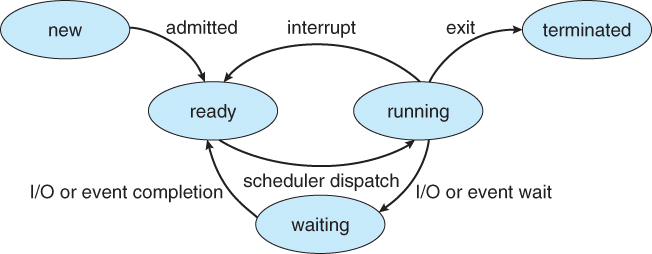

% Sistemas Operativos

###### Sistema Operativo ######

Un sistema operativo es un conjunto de programas y herramientas que controlan
y coordinan las actividades de una computadora o dispositivo electrónico,
y permiten a los usuarios interactuar con el hardware y el software de
manera sencilla y eficiente.
Está compuesto por un núcleo (o **kernel** que tiene control completo sobre el hardware en el que corre, y una serie de programas utilitarios que se comunican con el.

{width=45%}

###### Funcionalidades del Sistema Operativo ######

Las funcionalidades principales de un sistema operativo incluyen:

[//]: # (COMPACT)
. . .

Abstracción de hardware
:  El sistema operativo oculta los detalles específicos del hardware
 de la computadora a las aplicaciones y los usuarios.
 Esto permite permite a las aplicaciones interactuar con el hardware de
 una manera consistente y simplificada, sin tener que preocuparse por los
 detalles internos del hardware subyacente.

[//]: # (COMPACT)
. . .

Gestión del hardware
: El sistema operativo es responsable de gestionar el hardware de
 la computadora, como el procesador, la memoria, el disco duro, la tarjeta
 gráfica, entre otros.
 Controla cómo se utilizan estos recursos y asigna la cantidad adecuada
 de memoria y procesador a cada aplicación.
 
[//]: # (COMPACT)
. . .

Interfaz de usuario
: El sistema operativo proporciona una interfaz de usuario que permite
 a los usuarios interactuar con el ordenador y ejecutar aplicaciones y programas.

[//]: # (COMPACT)
. . .

Gestión de archivos
: El sistema operativo se encarga de gestionar los archivos y directorios
 del ordenador, lo que permite a los usuarios crear, modificar, copiar y
 eliminar archivos y carpetas.

[//]: # (COMPACT)
. . .

Multitarea
: Un sistema operativo permite que varias aplicaciones se ejecuten
 al mismo tiempo y asigna los recursos necesarios para que funcionen correctamen
te.

[//]: # (COMPACT)
. . .

Multiusuario
: Un sistema operativo puede ser utilizado por varios usuarios
 al mismo tiempo y garantiza que cada usuario tenga sus propios archivos
 y configuraciones.


###### Núcleo ######

 El **kernel** (o núcleo) de un sistema operativo es la parte central y más fundamental
 del mismo.
 Es responsable de controlar el acceso a los recursos del hardware, gestionar
 los procesos, la memoria y la entrada/salida, y proporcionar una interfaz
 para que las aplicaciones interactúen con el hardware del sistema.

```bash
$ uname -r
```

[//]: # (COMPACT)
. . .

Para casi cualquier tarea las aplicaciones de usuario necesitan pedirle
 permiso al kernel, a través de una instrucción denominada 
 [**llamada a sistema**](https://es.wikipedia.org/wiki/Llamada_al_sistema).

 Cuando se produce una llamada a sistema el CPU deja de ejecutar el programa,
 y comienza a ejecutar la funcionalidad del núcleo requerida, luego de la
 cual se continua con la ejecución del programa.


###### Proceso de arranque ######

Durante el **arranque de una PC**, ocurren varias cosas importantes que permiten
que el sistema operativo se inicie correctamente y la computadora esté
lista para su uso.

Al presionarse el botón de arranque se activa la fuente de alimentación
de la computadora, la cual suministra la energía necesaria para que la placa
madre comience a funcionar. A partir de aquí, comienza un proceso que
consiste en varias etapas:


###### POST (Power On Self Test) ######

POST (Power On Self Test)
: La placa madre realiza un autodiagnóstico para
 verificar que todos los componentes de hardware de la computadora
 estén funcionando correctamente. Si detecta algún problema, emitirá un
 mensaje de error y detendrá el proceso de arranque.

{width=45%}


###### Boot Loader ######

Boot Loader
: A continuación la placa madre debe cargar un programa llamado
 **cargador de arranque**. El cargador de arranque es un programa cuyo
 objetivo principal es cargar el núcleo del sistema operativo. El cargador
 de arranque mas utilizado en Linux es **GRUB**; y **bootmgr** es el
 proporcionado por los sistemas modernos de Windows.

:::::::::::::: {.columns}
::: {.column width="40%"}
{width=100%}
:::
::: {.column width="60%"}
{width=60%}
:::
::::::::::::::


###### Núcleo ######

Núcleo
: A continuación, el núcleo del sistema operativo toma el control de
 la computadora. Durante sus tareas iniciales se encargará de identificar
 el hardware disponible, cargar los controladores necesarios y montar el
 sistema de archivos del sistema. Finalmente dará comienzo al primer
 programa de usuario, a partir del cual se ejecutaran todos los demás
 programas.


###### Init ######

Init
: En los sistemas Linux, el programa inicial del sistema operativo se llama
 **init**. Init se encargará de cargar los scripts de arranque del sistema, así
 como también ejecutar los servicios esenciales para el funcionamiento
 del mismo, y proveer al usuario de un entorno gráfico o de linea de
 comandos.


###### Terminal ######

A menudo se utilizan términos como **terminal**, consola virtual,
emulador de terminal o intérprete de línea de comandos de forma indistinta, lo
que puede llevar a cierta confusión. A continuación, se explican las diferencias
entre estos términos:


###### Terminal ######

Terminal
: Se refiere a el o los dispositivos físicos que se utilizan para interactuar
 con un ordenador mediante la entrada y salida de texto. En la
 actualidad está compuesta principalmente por el teclado y el monitor.
 Consola virtual Es una aplicación implementada dentro del núcleo que
 provee acceso al sistema simulando una terminal de teletipo. En los sis temas
 tipo Unix se puede acceder a ellas presionando **Ctrl+Alt+F1**,
 **Ctrl+Alt+F2**, etc.

{width=45%}


###### Emulador de terminal ######

Emulador de terminal
: Es un programa de usuario que permite interactuar
 con un sistema operativo a través de una ventana en un entorno gráfico.
 Los emuladores de terminal son comúnmente utilizados para acceder a
 sistemas remotos o para ejecutar aplicaciones de línea de comandos en
 sistemas operativos.
 Para saber que emulador de terminal se está utilizando se puede escribir
 el comando:
```bash
$ echo $TERM
```

{width=45%}


###### Shell ######

Shell
: También llamado **interprete de linea de comandos**, es un programa
 que permite a un usuario interactuar con el sistema operativo mediante
 la ejecución de comandos a través de una interfaz de línea de comandos.
 Para saber que interprete de linea de comandos se está utilizando se
 puede escribir el comando:
```bash
$ echo $SHELL
```

Alguno de los interpretes de linea de comandos mas populares en los sistemas
Linux son: **sh**, **bash**, **zsh** y **fish**. En los sistemas operativos de
Microsoft se destacan: **COMMAND**, **cmd** y **PowerShell**.


###### Procesos ######

Un proceso es una instancia de un programa en ejecución. Durante su ciclo
de vida, atraviesa diferentes etapas las cuales incluyen:

Creación
: En esta etapa, el sistema operativo crea un nuevo proceso cuando se inicia un
 programa o se solicita mediante una llamada al sistema.
 Durante la creación, se asignan recursos como espacio de memoria, identificadores
 de proceso y otros atributos necesarios para la ejecución.

[//]: # (COMPACT)
. . .

Listo
: Después de ser creado, el proceso pasa al estado de **listo** y está a
 la espera de ser seleccionado por el planificador del sistema operativo
 para su ejecución. En este estado, el proceso está cargado en la memoria
 y listo para ejecutarse, pero aún no se le ha asignado tiempo de CPU.

[//]: # (COMPACT)
. . .

Ejecución
: Cuando un proceso es seleccionado por el planificador del sis tema, se mueve
 al estado de **ejecución**. En esta etapa, el procesador
 ejecuta las instrucciones del programa y realiza las tareas definidas por
 el proceso. El proceso continúa en este estado hasta que se hasta que se
 bloquea esperando alguna operación de entrada/salida.

[//]: # (COMPACT)
. . .

Bloqueado
: Un proceso puede entrar en el estado **bloqueado** si necesita
 esperar por alguna operación de entrada/salida, como leer datos de un
 archivo o esperar una respuesta de red. Cuando esto ocurre, el proceso
 se suspende temporalmente y se libera el uso del procesador.

[//]: # (COMPACT)
. . .

Finalización
: Cuando un proceso ha terminado de ejecutar todas sus instrucciones o ha sido
 terminado de manera forzada por el sistema operativo,
 entra en el estado de **finalización**. En esta etapa, se liberan los recursos
 asignados al proceso y se realiza la limpieza necesaria.
 Las funcionalidades principales de un sistema operativo incluyen:


###### Procesos ######

{width=55%}


###### Interfaz gráfica ######

Una interfaz gráfica de usuario es una forma de interactuar con un programa o
sistema operativo mediante el uso de elementos gráficos, como ventanas,
iconos, botones y menús, en lugar de usar comandos de texto en una línea de
comandos.

[//]: # (COMPACT)
. . .

A las interfaces de usuario gráficas las llamamos **GUI** por sus siglas en
inglés **Graphical User Interface**; en cambio a las interfaces de
linea de comandos las llamamos **CLI** por las siglas **Command Line Interface**.

[//]: # (COMPACT)
. . .

El entorno de escritorio, el sistema de ventanas, el servidor de pantalla y
el gestor de ventanas son componentes importantes de un sistema operativo
gráfico que trabajan juntos para proporcionar una interfaz de usuario intuitiva
y fácil de usar.


###### Interfaz gráfica ######

{width=55%}


###### Entorno de escritorio ######

Entorno de escritorio
: Es un conjunto de aplicaciones, herramientas y utilidades que proporcionan
 una interfaz de usuario gráfica para un sistema
 operativo. El entorno de escritorio incluye menús, barras de herramientas,
 iconos, fondos de pantalla, gestores de archivos y otras herramientas
 que hacen que el uso del sistema operativo sea más fácil e intuitivo para
 el usuario. Algunos ejemplos de entornos de escritorio son GNOME,
 KDE, XFCE y LXDE.

{width=45%}


###### Sistema de ventanas ######

Sistema de ventanas
: Es un sistema que permite la creación y manipulación
 de ventanas de aplicaciones en la pantalla. El sistema de ventanas se
 encarga de administrar la posición, tamaño, apariencia y eventos de las
 ventanas en la pantalla. También se encarga de la gestión de los recursos
 gráficos, como el uso de la memoria, la gestión de la entrada y salida de
 datos, y el manejo de la interacción entre aplicaciones. Algunos ejemplos
 de sistemas de ventanas son X11 y Wayland.


###### Servidor de pantalla ######

Servidor de pantalla
: Es un programa que se ejecuta en el sistema operativo
 y se encarga de controlar la pantalla, el teclado y el ratón del sistema. El
 servidor de pantalla recibe la entrada de teclado y ratón y la envía a las
 aplicaciones en ejecución en el sistema. También se encarga de mostrar
 la salida gráfica de las aplicaciones en la pantalla. El servidor de pantalla
 más utilizado en Linux es Xorg.


###### Gestor de ventanas ######

Gestor de ventanas
: Es un programa que se ejecuta en el entorno de escritorio y que se encarga de
 administrar la apariencia y el comportamiento de
 las ventanas de las aplicaciones. El gestor de ventanas proporciona una
 variedad de características, como la decoración de ventanas, la administración
 de escritorios virtuales, la configuración de atajos de teclado, y
 la gestión de la colocación de ventanas en la pantalla. Algunos ejemplos
 de gestores de ventanas son Compiz, Openbox y i3.

{width=55%}
