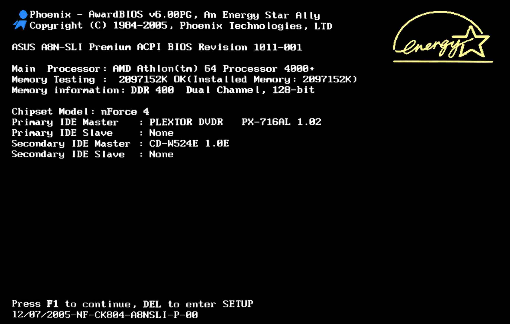

% Sistemas Operativos

###### Sistema Operativo ######

Un sistema operativo es un conjunto de programas y herramientas que controlan
y coordinan las actividades de una computadora o dispositivo electrónico,
y permiten a los usuarios interactuar con el hardware y el software de
manera sencilla y eficiente.
Está compuesto por un núcleo (o **kernel** que tiene control completo sobre el hardware en el que corre, y una serie de programas utilitarios que se comunican con el.

{width=45%}

###### Funcionalidades del Sistema Operativo ######

Las funcionalidades principales de un sistema operativo incluyen:

[//]: # (COMPACT)
. . .

Abstracción de hardware
:  El sistema operativo oculta los detalles específicos del hardware
 de la computadora a las aplicaciones y los usuarios.
 Esto permite permite a las aplicaciones interactuar con el hardware de
 una manera consistente y simplificada, sin tener que preocuparse por los
 detalles internos del hardware subyacente.

[//]: # (COMPACT)
. . .

Gestión del hardware
: El sistema operativo es responsable de gestionar el hardware de
 la computadora, como el procesador, la memoria, el disco duro, la tarjeta
 gráfica, entre otros.
 Controla cómo se utilizan estos recursos y asigna la cantidad adecuada
 de memoria y procesador a cada aplicación.
 
[//]: # (COMPACT)
. . .

Interfaz de usuario
: El sistema operativo proporciona una interfaz de usuario que permite
 a los usuarios interactuar con el ordenador y ejecutar aplicaciones y programas.

[//]: # (COMPACT)
. . .

Gestión de archivos
: El sistema operativo se encarga de gestionar los archivos y directorios
 del ordenador, lo que permite a los usuarios crear, modificar, copiar y
 eliminar archivos y carpetas.

[//]: # (COMPACT)
. . .

Multitarea
: Un sistema operativo permite que varias aplicaciones se ejecuten
 al mismo tiempo y asigna los recursos necesarios para que funcionen correctamen
te.

[//]: # (COMPACT)
. . .

Multiusuario
: Un sistema operativo puede ser utilizado por varios usuarios
 al mismo tiempo y garantiza que cada usuario tenga sus propios archivos
 y configuraciones.


###### Núcleo ######

 El **kernel** (o núcleo) de un sistema operativo es la parte central y más fundamental
 del mismo.
 Es responsable de controlar el acceso a los recursos del hardware, gestionar
 los procesos, la memoria y la entrada/salida, y proporcionar una interfaz
 para que las aplicaciones interactúen con el hardware del sistema.

```bash
$ uname -r
```

[//]: # (COMPACT)
. . .

Para casi cualquier tarea las aplicaciones de usuario necesitan pedirle
 permiso al kernel, a través de una instrucción denominada 
 [**llamada a sistema**](https://es.wikipedia.org/wiki/Llamada_al_sistema).

 Cuando se produce una llamada a sistema el CPU deja de ejecutar el programa,
 y comienza a ejecutar la funcionalidad del núcleo requerida, luego de la
 cual se continua con la ejecución del programa.


###### Proceso de arranque ######

Durante el **arranque de una PC**, ocurren varias cosas importantes que permiten
que el sistema operativo se inicie correctamente y la computadora esté
lista para su uso.

Al presionarse el botón de arranque se activa la fuente de alimentación
de la computadora, la cual suministra la energía necesaria para que la placa
madre comience a funcionar. A partir de aquí, comienza un proceso que
consiste en varias etapas:


###### POST (Power On Self Test) ######

POST (Power On Self Test)
: La placa madre realiza un autodiagnóstico para
 verificar que todos los componentes de hardware de la computadora
 estén funcionando correctamente. Si detecta algún problema, emitirá un
 mensaje de error y detendrá el proceso de arranque.

{width=45%}


###### Boot Loader ######

Boot Loader
: A continuación la placa madre debe cargar un programa llamado
 **cargador de arranque**. El cargador de arranque es un programa cuyo
 objetivo principal es cargar el núcleo del sistema operativo. El cargador
 de arranque mas utilizado en Linux es **GRUB**; y **bootmgr** es el
 proporcionado por los sistemas modernos de Windows.

:::::::::::::: {.columns}
::: {.column width="40%"}
{width=100%}
:::
::: {.column width="60%"}
{width=60%}
:::
::::::::::::::


###### Núcleo ######

Núcleo
: A continuación, el núcleo del sistema operativo toma el control de
 la computadora. Durante sus tareas iniciales se encargará de identificar
 el hardware disponible, cargar los controladores necesarios y montar el
 sistema de archivos del sistema. Finalmente dará comienzo al primer
 programa de usuario, a partir del cual se ejecutaran todos los demás
 programas.


###### Init ######

Init
: En los sistemas Linux, el programa inicial del sistema operativo se llama
 **init**. Init se encargará de cargar los scripts de arranque del sistema, así
 como también ejecutar los servicios esenciales para el funcionamiento
 del mismo, y proveer al usuario de un entorno gráfico o de linea de
 comandos.
